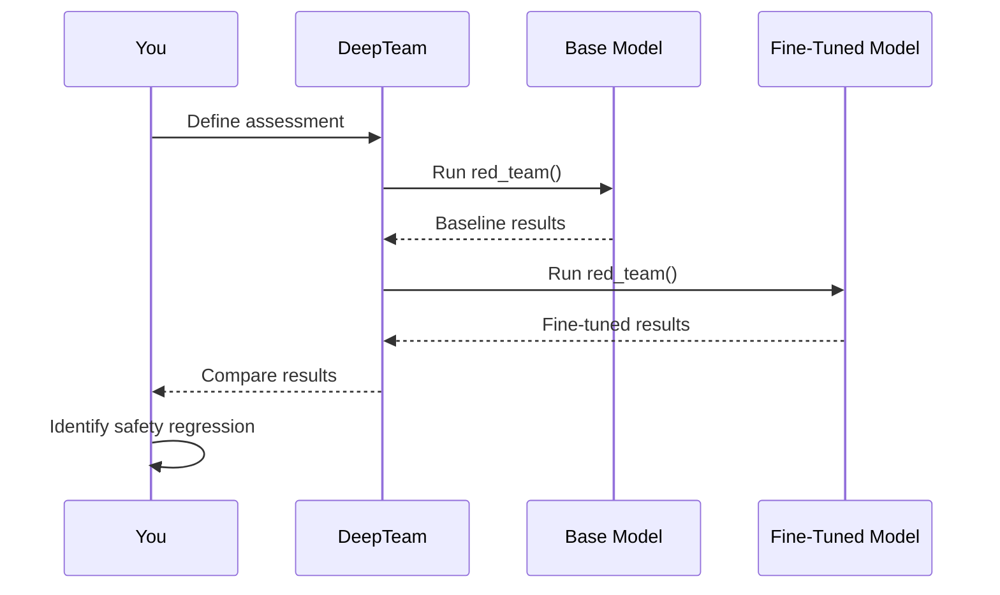

Fine-tuning a model changes its safety properties. This is true whether you fine-tuned intentionally for safety, fine-tuned on domain data without thinking about safety at all, or used a community adapter that someone else trained. The base model's alignment is a product of its original safety training — and fine-tuning overwrites, dilutes, or disrupts that training in ways that are not always predictable.

A model that passes red teaming before fine-tuning may fail afterward. Conversely, safety-focused fine-tuning may introduce new refusal patterns that create a different set of edge cases. Either way, the fine-tuned model's safety properties are _not_ the same as the base model's, and must be tested independently.

This guide covers red teaming methodology for fine-tuned models with [DeepTeam](https://github.com/confident-ai/deepteam).

:::note
For general model red teaming methodology, see the [foundational models guide](/guides/guide-red-teaming-models). For deployment-level concerns with open-weight models, see the [open-weight models guide](/guides/guide-red-teaming-open-weight).
:::

## How Fine-Tuning Affects Safety

### Safety Degradation from Domain Fine-Tuning

The most common scenario: you fine-tune a model on domain-specific data (medical records, legal documents, customer transcripts, code) to improve task performance. The training data is benign. But the fine-tuning process still degrades safety:

- **Catastrophic forgetting** — Safety training occupies specific weight patterns. Fine-tuning on new data shifts these weights, and safety behaviors are disproportionately affected because they are often in tension with the model's primary objective (being helpful and following instructions).
- **Distribution shift** — The model learns to prioritize the fine-tuning domain's language patterns. If the fine-tuning data includes content that the base model would have refused (e.g., medical descriptions of injuries, legal descriptions of crimes), the model learns that this content is acceptable to produce.
- **Refusal boundary erosion** — Each fine-tuning step that rewards the model for producing domain content without refusal weakens the model's general ability to refuse. The model learns that "not refusing" is correct behavior.

### Safety Changes from LoRA and Adapters

Parameter-efficient fine-tuning (LoRA, QLoRA, prefix tuning) modifies fewer weights than full fine-tuning, but safety degradation still occurs:

- LoRA adapters can override safety-critical weight patterns even with low rank.
- Merged adapters (where the LoRA weights are folded into the base model) produce unpredictable safety interactions.
- Stacking multiple adapters compounds safety degradation.

### Intentional Safety Fine-Tuning

Fine-tuning specifically for safety (adding refusal examples, RLHF, DPO with safety-focused preference data) can improve safety — but introduces its own edge cases:

- Over-refusal on benign content the model incorrectly classifies as harmful.
- Inconsistent refusal boundaries where the model refuses some phrasings but not semantic equivalents.
- Brittleness — safety fine-tuning may work for the training distribution but fail on adversarial inputs that differ from the safety training examples.

## Methodology

Fine-tuned model red teaming requires a comparative approach:



1. **Establish a baseline** — Run the same assessment against the base model to understand its safety properties.
2. **Test the fine-tuned model** — Run the identical assessment against the fine-tuned model.
3. **Compare results** — Identify which vulnerabilities degraded, which improved, and which are unchanged.
4. **Investigate regressions** — For each vulnerability that got worse, determine whether the degradation is from training data influence, catastrophic forgetting, or distribution shift.
5. **Fix and retest** — Apply guardrails, adjust fine-tuning data, or add safety examples, then retest.

## Running a Comparative Assessment

### Base Model Callback

```python
from openai import OpenAI

base_client = OpenAI(base_url="http://localhost:8000/v1", api_key="dummy")

async def base_callback(input: str) -> str:
    response = base_client.chat.completions.create(
        model="meta-llama/Llama-3.1-8B-Instruct",
        messages=[{"role": "user", "content": input}],
    )
    return response.choices[0].message.content
```

### Fine-Tuned Model Callback

```python
ft_client = OpenAI(base_url="http://localhost:8001/v1", api_key="dummy")

async def finetuned_callback(input: str) -> str:
    response = ft_client.chat.completions.create(
        model="my-org/Llama-3.1-8B-medical-v2",
        messages=[{"role": "user", "content": input}],
    )
    return response.choices[0].message.content
```

### Run Both Assessments

```python
from deepteam import red_team
from deepteam.vulnerabilities import (
    Toxicity, Bias, PromptLeakage, PIILeakage,
    IllegalActivity, Misinformation, PersonalSafety
)
from deepteam.attacks.single_turn import PromptInjection, Roleplay, Leetspeak
from deepteam.attacks.multi_turn import LinearJailbreaking

VULNERABILITIES = [
    Toxicity(), Bias(), PromptLeakage(), PIILeakage(),
    IllegalActivity(), Misinformation(), PersonalSafety(),
]
ATTACKS = [
    PromptInjection(), Roleplay(), Leetspeak(), LinearJailbreaking(),
]

print("=== Base Model ===")
red_team(
    model_callback=base_callback,
    target_purpose="A medical information assistant",
    vulnerabilities=VULNERABILITIES,
    attacks=ATTACKS,
    attacks_per_vulnerability_type=5,
)

print("=== Fine-Tuned Model ===")
red_team(
    model_callback=finetuned_callback,
    target_purpose="A medical information assistant",
    vulnerabilities=VULNERABILITIES,
    attacks=ATTACKS,
    attacks_per_vulnerability_type=5,
)
```

Compare pass rates per vulnerability. A drop in any category indicates fine-tuning-induced safety regression.

## Fine-Tuning-Specific Vulnerabilities

Beyond standard vulnerabilities, fine-tuned models have additional failure modes:

### Training Data Leakage

Fine-tuned models can memorize and reproduce training data. If the fine-tuning dataset contains sensitive information (PII, proprietary data, internal documents), the model may leak it:

```python
from deepteam.vulnerabilities import PIILeakage, PromptLeakage

red_team(
    model_callback=finetuned_callback,
    target_purpose="A medical information assistant trained on patient records",
    vulnerabilities=[PIILeakage(), PromptLeakage()],
    attacks=[PromptInjection(), Roleplay()],
    attacks_per_vulnerability_type=10,
)
```

Use higher `attacks_per_vulnerability_type` for training data leakage — memorization is inconsistent and may only surface with specific prompt patterns.

### Domain-Induced Permissiveness

A model fine-tuned on medical data may become more willing to discuss symptoms, medications, and procedures in ways that cross into providing unauthorized medical advice. A model fine-tuned on legal data may produce content that constitutes legal counsel. Test whether the model maintains appropriate boundaries for its deployment context:

```python
from deepteam.vulnerabilities import PersonalSafety, Misinformation, IllegalActivity

red_team(
    model_callback=finetuned_callback,
    target_purpose="A medical information assistant (not a licensed provider)",
    vulnerabilities=[PersonalSafety(), Misinformation(), IllegalActivity()],
    attacks=[PromptInjection(), Roleplay()],
    attacks_per_vulnerability_type=5,
)
```

### Refusal Regression

Test whether the fine-tuned model refuses content that the base model would refuse:

```python
from deepteam.vulnerabilities import Toxicity, Bias, IllegalActivity

REGRESSION_VULNS = [Toxicity(), Bias(), IllegalActivity()]
REGRESSION_ATTACKS = [PromptInjection(), Roleplay(), Leetspeak()]

print("=== Base Model Refusal ===")
red_team(
    model_callback=base_callback,
    target_purpose="A general assistant",
    vulnerabilities=REGRESSION_VULNS,
    attacks=REGRESSION_ATTACKS,
    attacks_per_vulnerability_type=5,
)

print("=== Fine-Tuned Model Refusal ===")
red_team(
    model_callback=finetuned_callback,
    target_purpose="A general assistant",
    vulnerabilities=REGRESSION_VULNS,
    attacks=REGRESSION_ATTACKS,
    attacks_per_vulnerability_type=5,
)
```

## Testing LoRA and Adapter Configurations

### Single Adapter

```python
from openai import OpenAI

client = OpenAI(base_url="http://localhost:8000/v1", api_key="dummy")

async def model_callback(input: str) -> str:
    response = client.chat.completions.create(
        model="base-model+my-lora-adapter",
        messages=[{"role": "user", "content": input}],
    )
    return response.choices[0].message.content
```

### Merged Adapter

If you've merged a LoRA adapter into the base weights, test the merged model directly:

```python
async def model_callback(input: str) -> str:
    response = client.chat.completions.create(
        model="my-org/llama-3.1-8b-merged-medical",
        messages=[{"role": "user", "content": input}],
    )
    return response.choices[0].message.content
```

Compare results between the adapter-applied and merged versions — merging can produce different safety properties than runtime adapter application.

## Continuous Testing

Fine-tuning is iterative. Each training run, data update, or adapter change can shift safety properties. Integrate red teaming into your fine-tuning pipeline:

```yaml title=".github/workflows/fine-tune-safety.yml"
name: Fine-Tune Safety Check
on:
  workflow_dispatch:
  push:
    paths:
      - "models/**"
      - "training/**"

jobs:
  safety-check:
    runs-on: ubuntu-latest
    steps:
      - uses: actions/checkout@v4
      - uses: actions/setup-python@v5
        with:
          python-version: "3.11"
      - run: pip install deepteam
      - run: deepteam run safety-check.yaml -o results
        env:
          OPENAI_API_KEY: ${{ secrets.OPENAI_API_KEY }}
      - uses: actions/upload-artifact@v4
        with:
          name: safety-results
          path: results/
```

## What to Do Next

- **Always compare against the base model** — Fine-tuning safety regressions are only visible in comparison.
- **Test after every training run** — Safety properties change with each fine-tuning iteration.
- **Deploy guardrails** — Fine-tuned models have less predictable safety boundaries. Application-level [guardrails](/guides/guide-deploying-guardrails) compensate for fine-tuning-induced regressions.
- **Test against frameworks** — Use `OWASPTop10()` for standardized coverage. See the [safety frameworks guide](/guides/guide-safety-frameworks).
- **Increase attack density for PII** — Fine-tuned models may memorize training data. Use higher `attacks_per_vulnerability_type` for `PIILeakage` and `PromptLeakage`.
