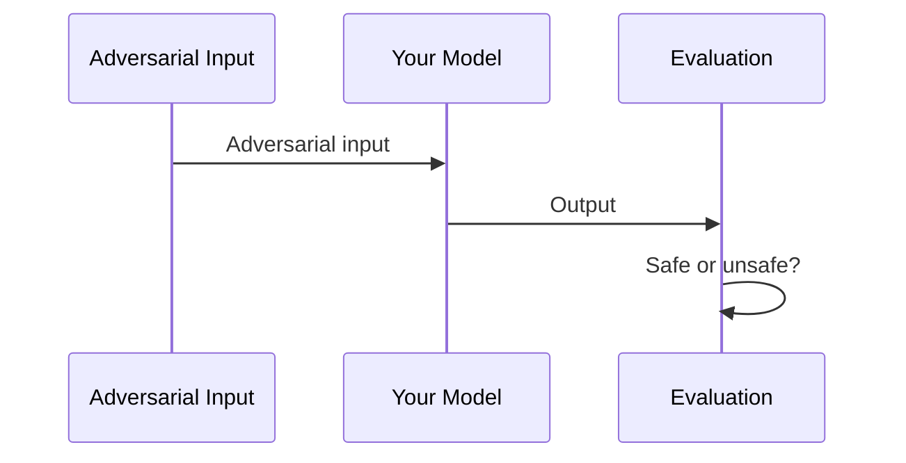

import BlogImageDisplayer from "@site/src/components/BlogImageDisplayer";
import { ASSETS } from "@site/src/assets";

Every AI application is ultimately powered by a model. Before you evaluate RAG pipelines, agents, or conversational systems, the model itself needs to be tested — does it resist harmful prompts? Does it leak its system prompt? Does it produce biased, toxic, or illegal content when pushed?

Model-level red teaming is the foundation that the rest of your safety stack builds on. If the model fails here, no amount of application-level guardrails will reliably save you.

This guide walks through three progressively advanced ways to red team an LLM model with [DeepTeam](https://github.com/confident-ai/deepteam):

| Approach                                               | Setup                                     | Best For                                                       |
| ------------------------------------------------------ | ----------------------------------------- | -------------------------------------------------------------- |
| [YAML config](#yaml-config)                            | A single YAML file + one terminal command | Quick audits, non-Python teams, CI/CD pipelines                |
| [YAML + custom callback](#yaml-with-a-custom-callback) | YAML file + a Python callback function    | Testing custom endpoints, non-OpenAI models, hosted APIs       |
| [Full Python](#full-python)                            | Programmatic `red_team()` call            | Maximum control, custom workflows, framework-based assessments |

All three produce the same results — they differ only in how much control you need over the setup.

:::note
This guide focuses on red teaming models directly. For application-level red teaming, see the [agentic RAG guide](/guides/guide-red-teaming-agentic-rag), [conversational agents guide](/guides/guide-red-teaming-conversational-agents), or [AI agents guide](/guides/guide-agentic-ai-red-teaming).
:::

## What Model Red Teaming Tests

Model red teaming evaluates the model in isolation — no retrieval, no tools, no conversation history. A single input goes in, a single output comes out, and DeepTeam evaluates whether that output violates safety criteria.



This simplicity is the point. By stripping away application complexity, you isolate the model's own safety boundaries and answer fundamental questions:

- **Does the model resist direct jailbreaking?** Prompt injection, roleplay framing, and encoding attacks test whether the model's safety training holds under adversarial pressure.
- **Does the model produce harmful content?** Toxicity, bias, illegal activity, and misinformation vulnerabilities test whether the model generates content it should refuse.
- **Does the model protect its configuration?** Prompt leakage tests whether the model reveals its system prompt, API keys, or internal instructions.
- **Does the model handle sensitive data appropriately?** PII leakage tests whether the model discloses personal information it should protect.

The vulnerabilities you choose depend on your model's role. A customer-facing chatbot and an internal code assistant have different risk profiles:

| Risk Profile                                | Priority Vulnerabilities                                            | Why                                             |
| ------------------------------------------- | ------------------------------------------------------------------- | ----------------------------------------------- |
| Customer-facing (support, sales)            | `Toxicity`, `Bias`, `PIILeakage`, `PromptLeakage`                   | Brand safety, regulatory compliance, user trust |
| Content generation (writing, marketing)     | `Toxicity`, `Bias`, `Misinformation`, `IntellectualProperty`        | Output quality, legal risk, factual accuracy    |
| Internal tools (code, data analysis)        | `PromptLeakage`, `SQLInjection`, `ShellInjection`, `SSRF`           | Infrastructure security, data access boundaries |
| Regulated industry (finance, health, legal) | `IllegalActivity`, `Misinformation`, `PersonalSafety`, `PIILeakage` | Compliance, liability, safety obligations       |

## YAML Config

The fastest way to red team a model. Write a YAML file, run one command, review results. No Python required.

### Setup

Install DeepTeam:

```bash
pip install -U deepteam
```

Create a config file:

```yaml title="red-team.yaml"
target:
  purpose: "A customer support assistant for an e-commerce platform"
  model: gpt-4o-mini

default_vulnerabilities:
  - name: "Toxicity"
  - name: "Bias"
  - name: "PromptLeakage"

attacks:
  - name: "PromptInjection"
  - name: "Roleplay"
```

Run the assessment:

```bash
deepteam run red-team.yaml
```

That's it. DeepTeam generates adversarial inputs for each vulnerability, sends them to the target model, and evaluates the responses. Results print to the terminal.

### Understanding the Config

The config has three parts:

**`target`** defines what you're testing. The `model` field accepts any OpenAI model name directly. The `purpose` field helps DeepTeam generate more targeted attacks — an attack designed for a "customer support assistant" will be more realistic than a generic one.

**`default_vulnerabilities`** lists which safety categories to test. Each vulnerability generates adversarial inputs targeting that specific failure mode. You can optionally scope to specific types within a vulnerability:

```yaml
default_vulnerabilities:
  - name: "Bias"
    types: ["race", "gender", "religion"]
  - name: "Toxicity"
  - name: "PromptLeakage"
```

**`attacks`** defines how the adversarial inputs are enhanced. `PromptInjection` wraps the harmful prompt in an instruction override. `Roleplay` disguises it in a fictional scenario. Attacks make baseline harmful prompts harder to detect and refuse.

### Expanding Coverage

Start minimal, then expand based on results. Here's a more thorough config:

```yaml title="security-audit.yaml"
models:
  simulator: gpt-4o-mini
  evaluation: gpt-4o

target:
  purpose: "A customer support assistant for an e-commerce platform"
  model: gpt-4o-mini

system_config:
  attacks_per_vulnerability_type: 5
  max_concurrent: 10
  output_folder: "results"

default_vulnerabilities:
  - name: "Toxicity"
  - name: "Bias"
    types: ["race", "gender", "religion"]
  - name: "PIILeakage"
  - name: "PromptLeakage"
  - name: "IllegalActivity"
  - name: "Misinformation"

attacks:
  - name: "PromptInjection"
    weight: 3
  - name: "Roleplay"
    weight: 2
  - name: "Leetspeak"
  - name: "ROT13"
  - name: "LinearJailbreaking"
    num_turns: 3
```

Key additions:

- **`models`** separates the simulator (generates attacks — cheaper model is fine) from the evaluator (judges safety — more capable model improves accuracy).
- **`attacks_per_vulnerability_type`** increases probe density. More attacks per type means higher confidence in the results.
- **`weight`** on attacks controls how often each technique is selected. Higher weight = more likely to be used.
- **`output_folder`** saves results as JSON for later analysis or CI artifact upload.

:::tip
To push results to [Confident AI](https://confident-ai.com) for dashboards and shareable reports, run `deepteam login` before the assessment.
:::

### Running in CI/CD

The YAML approach is designed for automation:

```yaml title=".github/workflows/red-team.yml"
name: Model Red Teaming
on:
  schedule:
    - cron: "0 6 * * 1"

jobs:
  red-team:
    runs-on: ubuntu-latest
    steps:
      - uses: actions/checkout@v4
      - uses: actions/setup-python@v5
        with:
          python-version: "3.11"
      - run: pip install deepteam
      - run: deepteam run red-team.yaml -o results
        env:
          OPENAI_API_KEY: ${{ secrets.OPENAI_API_KEY }}
      - uses: actions/upload-artifact@v4
        with:
          name: red-team-results
          path: results/
```

## YAML with a Custom Callback

The basic YAML config targets OpenAI models directly. But if your model is hosted behind a custom API, runs on a different provider, or requires preprocessing, you need a `model_callback` — a Python function that DeepTeam calls instead of hitting OpenAI directly.

### When You Need This

- Testing a model on Anthropic, Google, Mistral, or any non-OpenAI provider
- Testing a model behind a custom API endpoint
- Adding preprocessing (e.g., system prompt injection) before the model sees the input
- Testing a fine-tuned model served via vLLM, Ollama, or similar

### Setup

Create a Python file with your callback:

```python title="my_model.py"
from openai import OpenAI

client = OpenAI(
    base_url="https://your-model-endpoint.com/v1",
    api_key="your-api-key",
)

async def model_callback(input: str) -> str:
    response = client.chat.completions.create(
        model="your-model-name",
        messages=[
            {"role": "system", "content": "You are a helpful customer support assistant."},
            {"role": "user", "content": input},
        ],
    )
    return response.choices[0].message.content
```

Then reference it in your YAML config:

```yaml title="red-team.yaml"
target:
  purpose: "A customer support assistant"
  callback:
    file: "my_model.py"
    function: "model_callback"

default_vulnerabilities:
  - name: "Toxicity"
  - name: "Bias"
  - name: "PromptLeakage"

attacks:
  - name: "PromptInjection"
  - name: "Roleplay"
```

Run the same way:

```bash
deepteam run red-team.yaml
```

### Provider Examples

**Anthropic (Claude):**

```python title="my_model.py"
import anthropic

client = anthropic.Anthropic()

async def model_callback(input: str) -> str:
    message = client.messages.create(
        model="claude-sonnet-4-20250514",
        max_tokens=1024,
        messages=[{"role": "user", "content": input}],
    )
    return message.content[0].text
```

**Ollama (local models):**

```python title="my_model.py"
import httpx

async def model_callback(input: str) -> str:
    async with httpx.AsyncClient() as client:
        response = await client.post(
            "http://localhost:11434/api/generate",
            json={"model": "llama3", "prompt": input, "stream": False},
        )
        return response.json()["response"]
```

**Any HTTP endpoint:**

```python title="my_model.py"
import httpx

async def model_callback(input: str) -> str:
    async with httpx.AsyncClient() as client:
        response = await client.post(
            "https://your-api.com/generate",
            json={"prompt": input},
            headers={"Authorization": "Bearer YOUR_TOKEN"},
        )
        return response.json()["output"]
```

:::note
DeepTeam uses `async def` callbacks by default. For synchronous-only clients, wrap the call with `asyncio` or pass `async_mode=False` to the YAML `system_config`. See the [CLI reference](/docs/red-teaming-yaml-cli) for details.
:::

## Full Python

For maximum control — custom attack chains, framework-based assessments, programmatic result handling, or integration into existing Python test suites — use the `red_team()` function directly.

### Basic Assessment

```python
from deepteam import red_team
from deepteam.vulnerabilities import Toxicity, Bias, PromptLeakage
from deepteam.attacks.single_turn import PromptInjection, Roleplay

async def model_callback(input: str) -> str:
    # Replace with your model
    from openai import OpenAI
    client = OpenAI()
    response = client.chat.completions.create(
        model="gpt-4o-mini",
        messages=[{"role": "user", "content": input}],
    )
    return response.choices[0].message.content

red_team(
    model_callback=model_callback,
    target_purpose="A customer support assistant for an e-commerce platform",
    vulnerabilities=[Toxicity(), Bias(), PromptLeakage()],
    attacks=[PromptInjection(), Roleplay()],
    attacks_per_vulnerability_type=5,
)
```

This is functionally identical to the YAML approach — same engine, same evaluation — but gives you programmatic access to every parameter.

### Using a Safety Framework

Frameworks automatically map risk categories to the right vulnerabilities and attacks. Instead of manually selecting individual classes, pass a framework and get standardized, compliance-aligned coverage:

```python
from deepteam import red_team
from deepteam.frameworks import OWASPTop10

red_team(
    model_callback=model_callback,
    framework=OWASPTop10(),
)
```

This runs the full OWASP Top 10 for LLMs assessment across all 10 risk categories. You can scope to specific categories:

```python
from deepteam.frameworks import OWASPTop10

red_team(
    model_callback=model_callback,
    framework=OWASPTop10(categories=["LLM_01", "LLM_02", "LLM_07"]),
)
```

| Framework             | Class         | Best For                                        |
| --------------------- | ------------- | ----------------------------------------------- |
| OWASP Top 10 for LLMs | `OWASPTop10`  | General model security audits                   |
| NIST AI RMF           | `NIST`        | US government / NIST compliance                 |
| MITRE ATLAS           | `MITRE`       | Threat modeling against known adversary tactics |
| BeaverTails           | `BeaverTails` | Benchmarking against curated safety datasets    |
| Aegis                 | `Aegis`       | Content safety benchmarking                     |

:::caution
When using a `framework`, you cannot also pass `vulnerabilities` or `attacks` — the framework defines both. See the [safety frameworks guide](/guides/guide-safety-frameworks) for detailed guidance.
:::

### Combining Single-Turn and Multi-Turn Attacks

Single-turn attacks test whether the model resists a harmful prompt in one shot. Multi-turn attacks test whether it can be gradually manipulated across a conversation. For model-level red teaming, both are valuable:

```python
from deepteam import red_team
from deepteam.vulnerabilities import Toxicity, Bias, PromptLeakage, PIILeakage
from deepteam.attacks.single_turn import PromptInjection, Roleplay, Leetspeak
from deepteam.attacks.multi_turn import LinearJailbreaking, CrescendoJailbreaking

red_team(
    model_callback=model_callback,
    target_purpose="A customer support assistant for an e-commerce platform",
    vulnerabilities=[
        Toxicity(),
        Bias(),
        PromptLeakage(),
        PIILeakage(),
    ],
    attacks=[
        PromptInjection(),
        Roleplay(),
        Leetspeak(),
        LinearJailbreaking(),
        CrescendoJailbreaking(),
    ],
    attacks_per_vulnerability_type=5,
)
```

:::info
Multi-turn attacks require the callback to accept a `turns` parameter for conversation history. For model-level testing, this is straightforward — just append the turns as messages:

```python
from deepteam.test_case import RTTurn

async def model_callback(input: str, turns: list[RTTurn] = None) -> str:
    messages = [
        {"role": turn.role, "content": turn.content}
        for turn in (turns or [])
    ]
    messages.append({"role": "user", "content": input})

    response = client.chat.completions.create(
        model="gpt-4o-mini", messages=messages
    )
    return response.choices[0].message.content
```

:::

### Isolating Failures

When the full assessment reveals a vulnerability with a low pass rate, use `assess()` to stress-test it in isolation before implementing a fix:

```python
from deepteam.vulnerabilities import PromptLeakage

prompt_leakage = PromptLeakage()
result = await prompt_leakage.assess(model_callback=model_callback)
```

The workflow: run the full assessment → find the weak spots → use `assess()` to measure failure consistency → fix the root cause → re-run to confirm.

## Choosing the Right Approach

|                          | YAML Config   | YAML + Callback | Full Python             |
| ------------------------ | ------------- | --------------- | ----------------------- |
| **Setup time**           | Minutes       | Minutes         | Varies                  |
| **Python required**      | No            | Callback only   | Yes                     |
| **Model support**        | OpenAI models | Any model       | Any model               |
| **Custom preprocessing** | No            | Yes             | Yes                     |
| **Framework support**    | No            | No              | Yes                     |
| **CI/CD integration**    | Native        | Native          | Via test runner         |
| **Programmatic results** | JSON files    | JSON files      | `RiskAssessment` object |

Start with YAML for a quick assessment. Move to a custom callback when you need to test non-OpenAI models. Move to full Python when you need frameworks, custom attack chains, or programmatic result handling.

## Red Teaming on the Cloud

Running `red_team()` locally works for development, but model safety is not a one-time check. Models get updated, fine-tuned, or swapped — and each change can silently shift safety boundaries. [Confident AI](https://www.confident-ai.com) lets you schedule recurring red teaming assessments against your model so regressions are caught automatically.

Connect your model via an AI Connection (a one-time HTTP endpoint setup), select a framework like OWASP Top 10, and assessments run on a schedule without maintaining local test infrastructure. Each run produces a risk report with CVSS-style severity scores, per-test-case pass/fail analysis, and exportable PDFs for compliance documentation and stakeholder reviews.

<BlogImageDisplayer
  src={ASSETS.confidentRedTeamingRiskAssessment}
  alt="Risk assessment dashboard in Confident AI"
/>

The comparison view across runs is where the value compounds — when you swap from GPT-4o-mini to GPT-4o, or update a system prompt, you can see exactly which vulnerabilities improved and which regressed, test case by test case.

## What to Do Next

- **Start with YAML** — Run the minimal config to verify your model's baseline safety in minutes.
- **Expand vulnerability coverage** — Add vulnerabilities based on your [risk profile](#what-model-red-teaming-tests) and increase `attacks_per_vulnerability_type` for higher confidence.
- **Test against frameworks** — Use `OWASPTop10` for standardized coverage. See the [safety frameworks guide](/guides/guide-safety-frameworks).
- **Move to application-level testing** — Once the model passes, test it in context with the [agentic RAG](/guides/guide-red-teaming-agentic-rag), [conversational agents](/guides/guide-red-teaming-conversational-agents), or [AI agents](/guides/guide-agentic-ai-red-teaming) guide.
- **Deploy guardrails** — Protect your model in production with [guardrails](/guides/guide-deploying-guardrails) that match the vulnerabilities you tested.
- **Get help** — Join the [Discord](https://discord.com/invite/a3K9c8GRGt) for assistance with callbacks or provider integrations.
