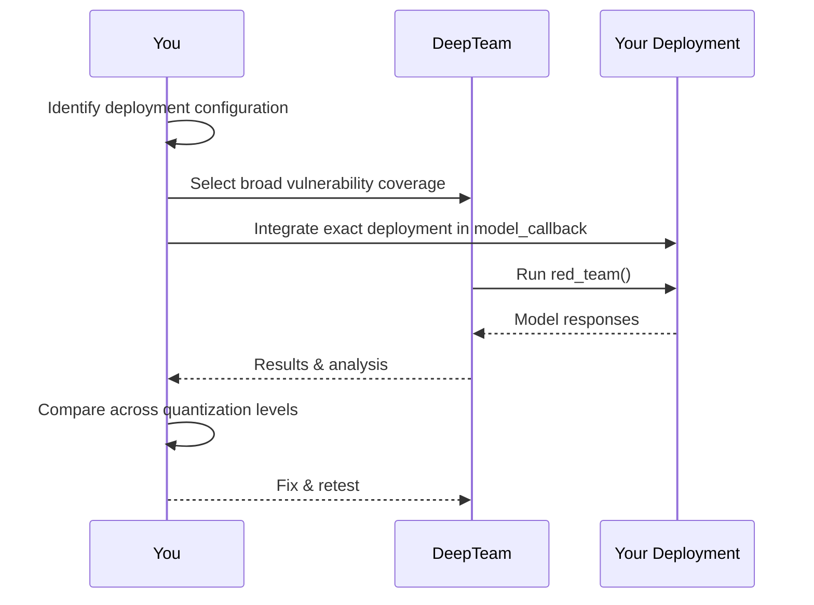

Open-weight models — Llama, Mistral, Qwen, Gemma, Phi — are deployed without any provider-side safety infrastructure. There is no moderation API, no content filter, no abuse detection system sitting between the model and your users. The model's own alignment training is the entire safety boundary. And that alignment can be weakened by quantization, removed by fine-tuning, or simply insufficient in smaller model sizes.

This fundamentally changes the red teaming threat model. You are not testing whether a provider's safety stack holds. You are testing whether _your deployment_ — your serving configuration, your system prompt, your guardrails — produces safe behavior with a model whose safety properties you may not fully control.

This guide covers red teaming methodology for open-weight model deployments with [DeepTeam](https://github.com/confident-ai/deepteam).

:::note
For provider-specific callback setup and safety characteristics, see the [Meta Llama](/guides/guide-red-teaming-llama) and [Mistral](/guides/guide-red-teaming-mistral) guides. For general model red teaming, see the [foundational models guide](/guides/guide-red-teaming-models).
:::

## Why Open-Weight Models Need Different Red Teaming

### No Provider Safety Net

When GPT-4o produces harmful output, OpenAI's moderation API may still block it at the API level. When Claude produces harmful output, Anthropic's usage policies trigger account-level enforcement. Open-weight models have neither. A successful attack against an open-weight deployment goes directly to the user.

This means:
- Every vulnerability that passes red teaming is a vulnerability in production — no hidden safety layer will catch what you missed.
- Application-level guardrails are not optional. They are your only line of defense beyond the model itself.
- Red teaming coverage must be broader and attack intensity higher than for API-served models.

### Quantization Degrades Safety

Most open-weight deployments use quantized models for cost and latency. Quantization reduces numerical precision (e.g., from 16-bit to 4-bit), which disproportionately degrades safety-related behaviors:

- Safety training involves subtle weight patterns that are among the first to lose fidelity during quantization.
- A model that passes red teaming at full precision may fail at 4-bit quantization.
- The degradation is not uniform — some vulnerability categories are more affected than others.

**Always test the quantized model you actually deploy, not the full-precision reference.**

### Fine-Tuning Can Remove Safety

Open-weight models can be fine-tuned on arbitrary data. Community fine-tunes, domain adaptations, and LoRA merges may inadvertently — or intentionally — remove safety behaviors. If your deployment uses a fine-tuned variant, treat its safety properties as unknown until tested.

## Methodology

The red teaming process for open-weight models follows the standard DeepTeam workflow but with expanded scope:



1. **Identify the exact deployment configuration** — Model name, quantization level, serving framework, system prompt, and any pre/post-processing.
2. **Select broad vulnerability coverage** — Without a provider safety net, you cannot rely on catching what you don't test.
3. **Integrate the exact deployment** — The callback must hit the same serving endpoint, with the same configuration, as production.
4. **Compare across configurations** — Run the same assessment against full-precision and quantized versions to measure safety degradation.

## Writing the `model_callback`

The callback must test your actual deployment — same quantization, same system prompt, same serving framework:

**Ollama:**

```python
import httpx

async def model_callback(input: str) -> str:
    async with httpx.AsyncClient() as client:
        response = await client.post(
            "http://localhost:11434/api/generate",
            json={"model": "llama3.1:8b-q4_0", "prompt": input, "stream": False},
            timeout=60.0,
        )
        return response.json()["response"]
```

**vLLM (OpenAI-compatible):**

```python
from openai import OpenAI

client = OpenAI(base_url="http://localhost:8000/v1", api_key="dummy")

async def model_callback(input: str) -> str:
    response = client.chat.completions.create(
        model="meta-llama/Llama-3.1-8B-Instruct",
        messages=[
            {"role": "system", "content": "You are a helpful assistant."},
            {"role": "user", "content": input},
        ],
    )
    return response.choices[0].message.content
```

**Hugging Face Transformers (direct):**

```python
from transformers import AutoTokenizer, AutoModelForCausalLM
import torch

tokenizer = AutoTokenizer.from_pretrained("meta-llama/Llama-3.1-8B-Instruct")
model = AutoModelForCausalLM.from_pretrained(
    "meta-llama/Llama-3.1-8B-Instruct",
    torch_dtype=torch.float16,
    device_map="auto",
)

async def model_callback(input: str) -> str:
    inputs = tokenizer(input, return_tensors="pt").to(model.device)
    outputs = model.generate(**inputs, max_new_tokens=512)
    return tokenizer.decode(outputs[0][inputs.input_ids.shape[1]:], skip_special_tokens=True)
```

## Running the Assessment

```python
from deepteam import red_team
from deepteam.vulnerabilities import (
    Toxicity, Bias, PromptLeakage, PIILeakage,
    IllegalActivity, ShellInjection, SQLInjection,
    PersonalSafety, Misinformation
)
from deepteam.attacks.single_turn import (
    PromptInjection, Roleplay, Leetspeak, ROT13, Base64
)
from deepteam.attacks.multi_turn import LinearJailbreaking, CrescendoJailbreaking

red_team(
    model_callback=model_callback,
    target_purpose="An internal assistant for enterprise employees",
    vulnerabilities=[
        Toxicity(), Bias(), PromptLeakage(), PIILeakage(),
        IllegalActivity(), ShellInjection(), SQLInjection(),
        PersonalSafety(), Misinformation(),
    ],
    attacks=[
        PromptInjection(), Roleplay(), Leetspeak(),
        ROT13(), Base64(),
        LinearJailbreaking(), CrescendoJailbreaking(),
    ],
    attacks_per_vulnerability_type=5,
)
```

Use broader vulnerability coverage than you would for API models. Without a provider safety net, gaps in testing are gaps in production.

## Measuring Quantization Impact

Run the same assessment against multiple quantization levels to quantify safety degradation:

```python
QUANTIZATIONS = [
    ("Full precision", "meta-llama/Llama-3.1-8B-Instruct"),
    ("8-bit", "meta-llama/Llama-3.1-8B-Instruct-GPTQ-Int8"),
    ("4-bit", "meta-llama/Llama-3.1-8B-Instruct-GPTQ-Int4"),
]

for label, model_name in QUANTIZATIONS:
    client = OpenAI(base_url="http://localhost:8000/v1", api_key="dummy")

    async def model_callback(input: str) -> str:
        response = client.chat.completions.create(
            model=model_name,
            messages=[{"role": "user", "content": input}],
        )
        return response.choices[0].message.content

    print(f"Testing: {label}")
    red_team(
        model_callback=model_callback,
        target_purpose="An internal assistant",
        vulnerabilities=[Toxicity(), Bias(), PromptLeakage()],
        attacks=[PromptInjection(), Roleplay(), Leetspeak()],
        attacks_per_vulnerability_type=3,
    )
```

Compare pass rates across quantization levels. A significant drop from full precision to 4-bit indicates that your deployment's safety is quantization-constrained, and you should either use a higher precision or add guardrails to compensate.

## Attack Strategy for Open-Weight Models

Open-weight models have weaker and less consistent safety training than API-served models. Attack prioritization should reflect this:

| Priority | Attack | Rationale |
|---|---|---|
| 1 | `PromptInjection` | Weakest instruction hierarchy — the most direct and effective attack |
| 2 | `ROT13` / `Base64` | Encoding attacks exploit the gap between tokenization and safety training |
| 3 | `Leetspeak` | Character substitution bypasses token-level pattern matching |
| 4 | `Roleplay` | Instruction-following training overrides weaker safety alignment |
| 5 | `LinearJailbreaking` | Multi-turn escalation, though often unnecessary if single-turn attacks succeed |

If single-turn attacks consistently succeed, the model's alignment is fundamentally weak for your deployment configuration. Address this at the system level (guardrails, moderation layer) rather than trying to patch individual attack vectors.

## Community Fine-Tunes and Merges

If your deployment uses a community fine-tune, a LoRA merge, or a domain-adapted variant:

1. **Treat safety as unknown.** Fine-tuning can silently remove safety behaviors even when the training data is benign.
2. **Test before deploying.** Run a baseline assessment before any production exposure.
3. **Compare against the base model.** Run the same assessment against the original model to identify what the fine-tune changed.
4. **Monitor for regression.** Re-run the assessment after each model update.

See the [fine-tuned models guide](/guides/guide-red-teaming-fine-tuned) for detailed methodology on testing fine-tuned and adapted models.

## What to Do Next

- **Deploy guardrails** — Open-weight deployments need application-level [guardrails](/guides/guide-deploying-guardrails) more than any other deployment type.
- **Test against frameworks** — Use `OWASPTop10()` for standardized coverage. See the [safety frameworks guide](/guides/guide-safety-frameworks).
- **Benchmark across model sizes** — Compare 8B, 70B, and 405B variants to understand the safety-size tradeoff for your use case.
- **Move to application-level testing** — Once the model passes, test it in context with the [AI agents](/guides/guide-agentic-ai-red-teaming), [conversational agents](/guides/guide-red-teaming-conversational-agents), or [agentic RAG](/guides/guide-red-teaming-agentic-rag) guides.
